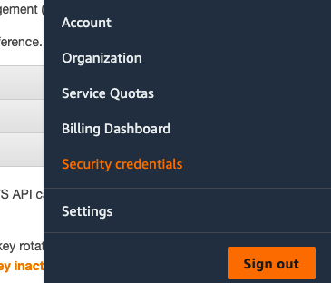
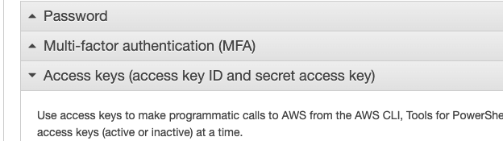
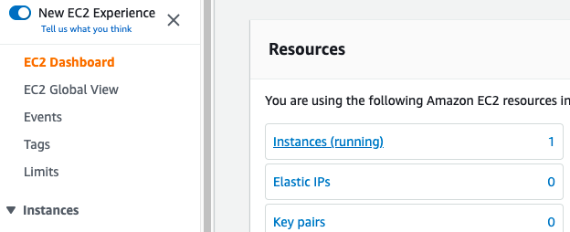

#### What is Terraform ?

Terraform is an infrastructure as code (IaC) tool developed by Hashicorp which allows you to build, change, and version infrastructure safely and efficiently. This includes both low-level components like compute instances, storage, and networking, as well as high-level components like DNS entries and SaaS features.

Okay, Lets create an EC2 instance on Amazon Freetier using Terraform,

##### Prerequistis
1. AWS account

##### Steps

###### 1. Install terraform

Download and install terraform on your local machine from [hashicorp](https://www.terraform.io/downloads).

###### 2. Generate Access keys (access key ID and secret access key) in AWS

Terraform should be provided with AWS Access keys, so it can communicate with it. Follow these steps to generate access keys in AWS ,

1. Go to Security Credentials by clicking on your username,



2. On your Security Credentials Page click on *Access Keys* tab.



3. Click on *Create New Access Key* button

4. Note down the Access Key Id and Secrete Access Key

###### 3. Create your first Terraform infrastructure

Lets start by creating main.tf file

First step is to inform terraform that aws is the provider and use the credentials you generated.

```shell
provider "aws" {
    region = "us-west-1"
    access_key = "<your copied access key>"
    secret_key = "<your copied secrete key>"
}
```

Next instruction is to create the ec2 instance with the name "ec2_dev" (This name can be anything)

To find the machine images go to EC2 -> Images -> AMIs and filter public images and pick one from AMI ID column.

```shell
resource "aws_instance" "ec2_dev" {
    ami = "ami-02541b8af977f6cdd" // Amazon Machine Image
    instance_type = "t2.micro" // Freetire instance type
    tags = {
      "Name" = "Terraform EC2" // instace tag
    }
}
```

Now main.tf is ready.

###### 4. Terraform init, plan and apply

Executing the following set of commands on the root folder of main.tf will create our expected ec2 instance and launches it.

terraform init command downloads all the dependecies required for the provider AWS.

```shell
terrform init
```
terraform plan command shows you the execution plan of terraform that how and what are all the resources its gonna generate for you. So you can validate and verify before applying it.

```shell
terrform plan
```

Once you have verified the generated plan , you can execute them using *apply* command.

```shell
terrform apply
```

Once this command succeed, you can find the newly created instance running in your EC2 Dashboard.




###### 5. Terraform destroy

To remove or delete everything that we created through main.tf , run the following commond from the same folder.

```shell
terrform destroy
```


######References
1. [Terrform](https://www.terraform.io/)