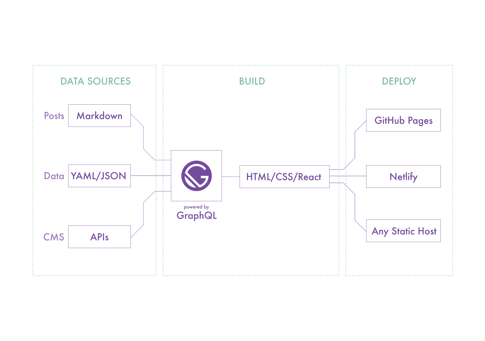

Gatsby is an frontend framework which makes use of GraphQL, ReactJS and many other javascript libraries. It is so famous for its high speed performance and SEO.It has lots of starter templates which helps you build your pages quick.

So what makes it special? Why are we talking specifically about it?

Gatsby has massive ecosystem of Plugins, Themes and Starters. When you want to build a website , you can just go and pick the gatsby starters aka templates that you want and start building on top of it. Lets say we want to build a website for blogging.

It processes markdown files and let you present its content in the html. 

It provides easy ways to implement routing ,filtering,sorting and pagination for those markdown contents or any datasource using GraphQL.For example ,just adding one more new markdown file would auto create routing path for it and make it available in the frontend.

#####Gatsby Architecture

It starts with processing the datasource with the help of GraphQL and presented in UI using React and it can be deployed in any static host.

#####Using Gatsby

Using Gatsby we can build any type of static website. Looking at the gatsby-starters you can understand where its mostly used and appreciated. I personally felt its great for building blogs. you can focus on your blog content rather working on how to style and align the contents. It is just a markdown file away to publish your content to the world.

#####Conclusion

Gatsby is a great unique framework to build static websites blazing fast. Its best for bloggers.